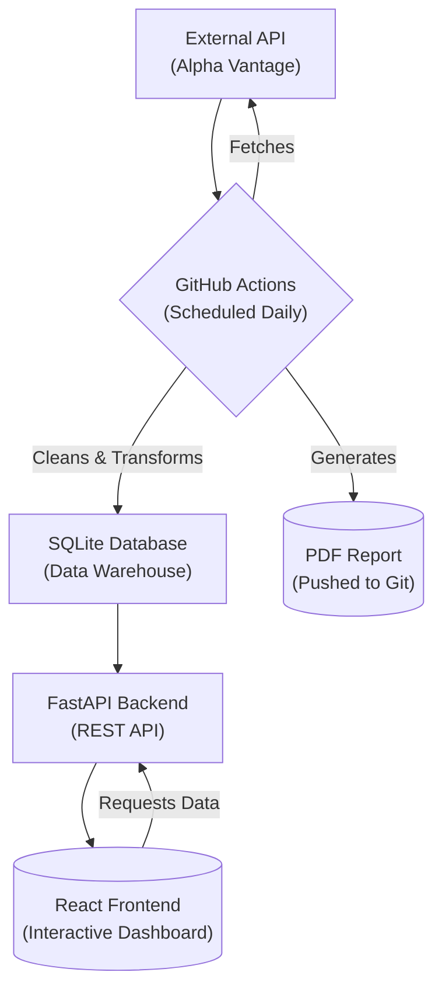

# Financial Analytics Platform

A full-stack data analytics platform that automates the ingestion, processing and visualization of daily financial market data. This project demonstrates an end-to-end data engineering lifecycle, from a scheduled ETL pipeline to a responsive, interactive React-based dashboard.

## Business Problem & Motivation

In many financial organizations, analysts and decision-makers rely on manual data gathering and static reports (like Excel spreadsheets) to track market performance. This process is often slow, prone to human error, and lacks the interactivity needed for deep, timely analysis.

This platform was built to solve that problem by providing a single, automated and reliable source of truth. It centralizes the entire data workflow from acquisition and validation to storage and visualization into a self-sustaining system, empowering users with immediate access to clean, up-to-date and interactive financial insights.

## High-Level Architecture

This platform is composed of two main systems that work in concert: an offline ETL pipeline and an online API/frontend application.




## Key Features

- **Automated ETL Pipeline:** A Python-based pipeline, scheduled with GitHub Actions, automatically extracts data from a third-party API daily.
    
- **Robust Data Processing:** Implements a full transformation layer using Pandas for cleaning and Pydantic for strict schema validation, ensuring high data integrity.
    
- **Persistent Data Storage:** Loads cleaned data into a centralized SQLite database, which acts as a data mart for the application.
    
- **High-Performance REST API:** A FastAPI backend serves the processed data through well-documented, asynchronous endpoints.
    
- **Interactive Frontend Dashboard:** A responsive dashboard built with React and TypeScript provides a multi-chart interface for data exploration, including KPIs, a detailed data table, and interactive historical charts.
    
- **Automated PDF Reporting:** The ETL pipeline automatically generates and commits a polished, executive-ready PDF summary report at the end of each run.
    
- **Continuous Integration (CI):** A separate GitHub Actions workflow automatically runs linters and unit tests on every code push to maintain code quality and prevent regressions.

## Dashboard Preview
Below is a screenshot of the main application dashboard, showing the KPI cards, the market overview table, and the interactive historical charts for a selected stock.


## Tech Stack

This project utilizes a modern, robust stack for each part of the application:

| Category | Technology | Purpose |
| --- | --- | --- |
| **Backend** | Python, FastAPI, SQLAlchemy, Pydantic | For a high-performance, asynchronous, and type-safe REST API. |
| **Frontend** | React, TypeScript, Recharts | For a responsive, interactive, and type-safe user interface with data visualizations. |
| **Data Pipeline** | Pandas, WeasyPrint, Jinja2 | For data transformation, cleaning, and automated PDF report generation. |
| **Database** | SQLite | For lightweight, persistent, serverless data storage. |
| **DevOps** | GitHub Actions, pytest, black | For CI/CD, automated testing, code formatting, and scheduled job execution. |

## CI/CD and Code Quality

This project is configured with a professional Continuous Integration (CI) pipeline using GitHub Actions to ensure code quality and reliability:

-   **Automated Testing:** On every push to the `main` branch, the full suite of unit tests is run using `pytest` across multiple Python versions (3.9, 3.10, 3.11).
-   **Code Formatting:** The `black` code formatter is automatically run to ensure a consistent and readable code style across the project.
-   **Scheduled ETL:** A separate workflow automatically runs the entire data ingestion and report generation pipeline on a daily schedule, ensuring the platform's data is always up-to-date.

## Data Assumptions & Design Decisions

The architecture of this platform was built on several key assumptions and intentional design choices:

*   **API Rate Limiting:** The Alpha Vantage free tier has a strict rate limit. The ETL pipeline's API client was architected with an `asyncio.Semaphore` to control concurrency and a delay between calls, ensuring robust and compliant data extraction without overwhelming the source API.
*   **Data Integrity:** Data quality is enforced at multiple layers:
    1.  **Schema Validation:** Pydantic models in the ETL pipeline validate the structure and types of incoming raw data, rejecting non-conforming records.
    2.  **Uniqueness:** A `UNIQUE` constraint on the `(symbol, date)` columns in the SQLite database prevents duplicate data from ever being saved.
*   **Simplicity over Complexity (State Management):** The frontend was initially architected with a global state management library (Zustand). After encountering significant debugging challenges related to silent rendering failures in React's StrictMode, a deliberate decision was made to refactor. The final architecture uses React's native `useState` and `useEffect` hooks with a "lift state up" pattern, resulting in a simpler, more predictable, and more robust data flow.
*   **Idempotency:** The database `CREATE TABLE` statement includes `IF NOT EXISTS`, and the ETL pipeline is designed to handle duplicate data gracefully. This means the pipeline can be re-run multiple times without causing errors or corrupting the data.
*   **Database Choice:** SQLite was chosen for its simplicity and serverless nature, making the project highly portable and easy to set up. The data access layer is built using SQLAlchemy, which would facilitate a straightforward migration to a more powerful, production-grade database like PostgreSQL if needed.


## Setup and Installation

To run this project locally, you will need Python (3.9+) and Node.js (v16+) installed.

**1. Clone the Repository:**
```bash
git clone https://github.com/Calistus-design/Financial_Analytics_Platform.git
cd Financial_Analytics_Platform
```

**2. Configure Environment Variables:**
*   This project requires an API key from Alpha Vantage for data extraction.
*   You can get a free key instantly from the [Alpha Vantage website](https://www.alphavantage.co/support/#api-key).
*   Once you have your key, create a file named `.env` in the root of the project.
*   Add your key to this file like so:
    ```env
    ALPHA_VANTAGE_API_KEY="YOUR_API_KEY_HERE"
    ```        
        
    
    **3. Set up the Python Backend & Pipeline:**
    
    
    ```bash
    # Create and activate a virtual environment
    python -m venv venv
    .\venv\Scripts\activate
    
    # Install Python dependencies
    pip install -r requirements.txt
    ```
    
    **4. Set up the React Frontend:**
    
    ```bash
    # Navigate to the frontend directory
    cd frontend
    
    # Install Node.js dependencies
    npm install
    ```
    
    ## Running the Application
    
    This application has three main parts that can be run. **You must run the ETL pipeline at least once before starting the backend and frontend.**
    
    **1. Run the ETL Pipeline (Manual):**
    
    - This will fetch the latest data and populate the database.
        
    - From the project root directory (with venv active):
        
    
    ```bash
    python -m pipeline.main
    ```
    
    **2. Run the Backend API Server:**
    
    - This server provides the data to the frontend.
        
    - From the project root directory (with venv active), in a **separate terminal**:
        
    ```bash
    uvicorn backend.main:app --reload
    ```
    
    - The API will be accessible at http://127.0.0.1:8000.
        
    
    **3. Run the Frontend Development Server:**
    
    - This will launch the interactive dashboard.
        
    - From the frontend/ directory, in a **third terminal**:
        
    
    ```bash
    npm start
    ```
    
    - The application will open automatically in your browser at http://localhost:3000.


## Future Improvements

This platform provides a solid foundation for a comprehensive financial analytics tool. Future enhancements could include:

*   **Migration to a Production Database:** Replace SQLite with a more robust, concurrent database like PostgreSQL or a cloud-native solution to handle larger data volumes and multiple users.
*   **User Authentication:** Implement an authentication layer (e.g., using JWTs) to secure the API and dashboard.
*   **Enhanced Caching:** Introduce a caching layer (e.g., with Redis) for frequently accessed API endpoints to improve performance and reduce database load.
*   **Advanced Visualizations:** Add more complex charts, such as candlestick charts for price action or moving average overlays.
*   **Containerization:** Fully containerize the backend and frontend services using Docker and Docker Compose for streamlined deployment and environment consistency.
