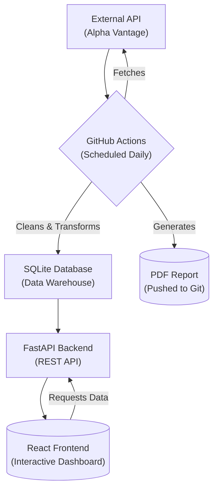

# Financial Analytics Platform

A full-stack data analytics platform that automates the ingestion, processing and visualization of daily financial market data. This project demonstrates an end-to-end data engineering lifecycle, from a scheduled ETL pipeline to a responsive, interactive React-based dashboard.

## Business Problem & Motivation

In many financial organizations, analysts and decision-makers rely on manual data gathering and static reports (like Excel spreadsheets) to track market performance. This process is often slow, prone to human error, and lacks the interactivity needed for deep, timely analysis.

This platform was built to solve that problem by providing a single, automated and reliable source of truth. It centralizes the entire data workflow from acquisition and validation to storage and visualization into a self-sustaining system, empowering users with immediate access to clean, up-to-date and interactive financial insights.

## High-Level Architecture

This platform is composed of two main systems that work in concert: an offline ETL pipeline and an online API/frontend application.

## Key Features

- **Automated ETL Pipeline:** A Python-based pipeline, scheduled with GitHub Actions, automatically extracts data from a third-party API daily.
    
- **Robust Data Processing:** Implements a full transformation layer using Pandas for cleaning and Pydantic for strict schema validation, ensuring high data integrity.
    
- **Persistent Data Storage:** Loads cleaned data into a centralized SQLite database, which acts as a data mart for the application.
    
- **High-Performance REST API:** A FastAPI backend serves the processed data through well-documented, asynchronous endpoints.
    
- **Interactive Frontend Dashboard:** A responsive dashboard built with React and TypeScript provides a multi-chart interface for data exploration, including KPIs, a detailed data table, and interactive historical charts.
    
- **Automated PDF Reporting:** The ETL pipeline automatically generates and commits a polished, executive-ready PDF summary report at the end of each run.
    
- **Continuous Integration (CI):** A separate GitHub Actions workflow automatically runs linters and unit tests on every code push to maintain code quality and prevent regressions.
